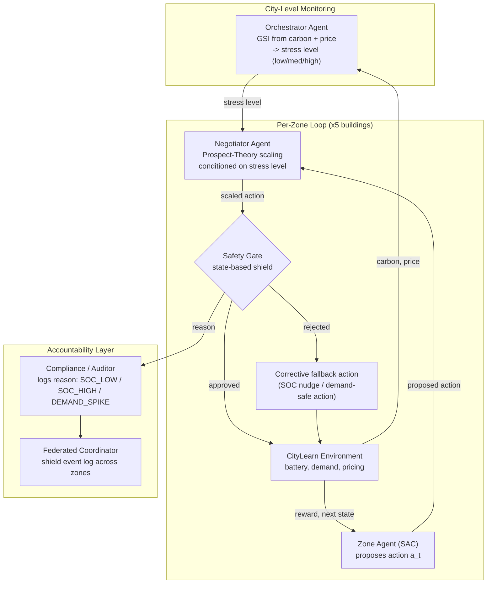

# SynapCity

**A Safety-Gated, Behaviorally-Aware Multi-Agent Framework for City-Scale Energy Management**

Research Assistant: Muhammad Salman Khalid Awan
Status: Minimum Viable Build (MVB) — 3 of 6 agents implemented and running on real CityLearn dynamics; results are being re-validated after a Safety Gate rewrite (see [Current Status](#9-current-status--honesty-notes)).

---

## Table of Contents

1. [Problem](#1-problem)
2. [The Gap](#2-the-gap)
3. [Proposed Solution](#3-proposed-solution)
4. [Agents — 6 Designed, 3 Implemented](#4-agents--6-designed-3-implemented)
5. [Architecture Diagram](#5-architecture-diagram)
6. [Core Novelty](#6-core-novelty)
7. [Related Work](#7-related-work)
8. [Repository Structure](#8-repository-structure)
9. [Current Status — Honesty Notes](#9-current-status--honesty-notes)
10. [Setup](#10-setup)
11. [Run Order](#11-run-order)
12. [Research Questions & Evaluation Plan](#12-research-questions--evaluation-plan)
13. [Work Remaining](#13-work-remaining)

---

## 1. Problem

Smart cities manage electricity through largely centralized control systems that must coordinate thousands of heterogeneous, independently-owned loads — buildings, EV chargers, industrial units — under increasingly volatile supply driven by renewable integration. Centralized control does not scale to this heterogeneity and dynamism:

- **Decision latency grows with system size.** A single controller reasoning over thousands of assets cannot react at the timescale grid volatility demands.
- **A single point of failure can cascade citywide.** Centralized optimizers have no natural boundary that contains a bad decision to the zone that made it.
- **Citizen behavior is treated as a fixed parameter**, not as something that shifts with how stressed the grid currently is — so incentive mechanisms miscalibrate exactly when it matters most (peak stress).

## 2. The Gap

The closest published frameworks (Section 7) already combine **digital twins + federated learning + multi-agent control** for energy governance. That general combination is no longer novel by itself — it is an active, contested space. Three specific gaps remain open in that literature:

| Gap | What existing work does | What's missing |
|---|---|---|
| **Safety enforcement** | Safety is a reward term, or a passive digital-twin sync that observes but doesn't gate | A **hard, pre-execution constraint**: actions are tested and explicitly approved/rejected *before* they touch the environment |
| **Behavioral modeling** | Prospect-Theory-based citizen models use **fixed** loss-aversion/risk parameters | Parameters that **shift with real-time grid stress**, via a documented mapping |
| **Cross-agent state sharing** | Either raw data sharing (privacy cost) or no shared state (non-stationarity) | A **shared observation space** across sectors that mitigates MARL non-stationarity without moving raw data, and without overclaiming blockchain/ledger semantics it doesn't have |

SynapCity's novelty is staked on closing these three specific gaps — not on the general architecture, which is contested territory (Section 6).

## 3. Proposed Solution

SynapCity is a multi-agent framework in which:

- **Zone-level control agents** propose energy-management actions for their building/microgrid.
- Every proposed action passes through a **discrete, pre-execution Safety Gate** — a state-based shield that approves or rejects it *before* it is applied, with a corrective (not merely dampening) fallback on rejection.
- A dedicated **Negotiator Agent** models citizen response to incentives using **dynamically-parameterized Prospect Theory**, where loss-aversion and risk parameters shift with a real-time Grid Stress Index rather than staying fixed.
- Zones are designed to share **learned strategies via federation**, not raw data, and to share a **cross-sector observation space** so agents see a consistent view of grid state without exchanging private telemetry.

The architecture is designed for city-scale federation; empirical work to date validates the core mechanism at MVB scale on a single CityLearn dataset (5 buildings, `citylearn_challenge_2022_phase_1`).

## 4. Agents — 6 Designed, 3 Implemented

| # | Agent | Role | Status |
|---|---|---|---|
| 1 | **Orchestrator** | Reads district-wide carbon intensity and price, computes a calibrated Grid Stress Index (GSI), and classifies it into low/medium/high | **Implemented** (`orchestrator.py`) — feeds stress level to the Negotiator; per-step GSI logged to CSV |
| 2 | **Zone Agent** | Local control per building/microgrid, SAC-based | **Implemented** |
| 3 | **Safety Gate** | Pre-execution test-and-approve/reject (state-based shield), per-building, with a corrective fallback | **Implemented** (`safety_gate.py`) |
| 4 | **Compliance / Auditor** | Logs rejected actions with a plain-language reason (SOC_LOW / SOC_HIGH / DEMAND_SPIKE) | **Implemented**, rule-based (`auditor.py`) — not yet an "explainable AI" module; see [Current Status](#9-current-status--honesty-notes) |
| 5 | **Federated Coordinator** | Aggregates per-zone Safety Gate events into a shared, readable log | **Implemented at log level only** (`federated_coordinator.py`) — does **not** yet share learned policy parameters (no FedAvg); policy-level federation is scoped as Future Work |
| 6 | **Negotiator** | Prospect-Theory-based citizen incentive negotiation, parameterized by Orchestrator's stress level | **Implemented** (`negotiator.py`) |

**Framing for the paper:** 3 agents (Zone Agent, Safety Gate, Negotiator) were fully novel-mechanism implementations from the start. The Orchestrator, Auditor, and Federated Coordinator are implemented as working scaffolds at MVB scope (stress classification, rule-based logging, shared event log) rather than as their most ambitious designed form (dynamic subgoal decomposition, model-based explainability, policy federation). Say exactly that in the Limitations section — it's a stronger, more defensible claim than implying all six are complete.

## 5. Architecture Diagram



**Reading the diagram:** the Orchestrator and Negotiator sit *upstream* of the Safety Gate — they shape what action is proposed. The Gate is the last word: it never trusts the upstream agents and re-checks the actual physical state (SOC, demand) before anything reaches the environment. The Auditor and Federated Coordinator are downstream — they only ever see what the Gate decided, never raw model internals, which is what keeps the audit log honest.

## 6. Core Novelty

Verified against the closest 2025–2026 literature (Section 7). The general combination — digital twin + federated learning + agentic multi-agent control for city energy governance — is **not** novel by itself; it is an active, contested research space. Novelty is staked on three specific mechanisms:

1. **Discrete pre-execution Safety Gate.** A hard constraint, not a reward term: every proposed action is tested and explicitly approved or rejected *before* it is applied to the environment, with an active corrective fallback (not passive dampening) on rejection. This differs from the passive digital-twin-synchronization pattern used in the closest comparable frameworks, where the twin observes and predicts but does not gate.
2. **Dynamically-parameterized Prospect-Theory negotiation.** Loss-aversion (λ) and risk-weighting (α) parameters shift with a real-time, calibrated Grid Stress Index via a documented heuristic mapping, rather than the fixed constants used in prior Prospect-Theory-MARL work in energy and P2P trading.
3. **Cross-sector shared observation space.** Zone agents across sectors read from one shared state to mitigate MARL non-stationarity, without moving raw private data between zones — and deliberately *not* framed as a "ledger," to avoid implying blockchain/consensus guarantees the system doesn't provide.

## 7. Related Work

Your original literature review named four closest competing frameworks (DT-FMAI 2026, FSDOF 2025, Pandi & Iyer 2026, and multiple 2023–2025 Prospect-Theory-MARL papers). I could not independently verify exact DOIs for those specific labels through search — they may be internal shorthand from your review, a preprint not yet indexed, or a title I searched under the wrong spelling. **Keep your own citations for those four and paste the DOIs here**; don't drop them just because I couldn't confirm them.

What I *could* verify are real, closely-related 2025–2026 papers in the same sub-area, useful either as additional citations or as a sanity check that the space is as active as your review says:

- Prasetiawan et al., ["Intelligent Energy Virtualization for Sustainability: Meta-Analysis of AI-Based Digital Twins and Federated Learning in Zero-Carbon Grid Optimization"](https://doi.org/10.18280/jesa.590206), *Journal Européen des Systèmes Automatisés*, 2026 — PRISMA meta-analysis of 50 studies combining AI-driven digital twins with federated learning for grid optimization; useful as a survey-level citation for "the general combination is an active space."
- Hua, Oikonomou, Djemame, Tziritas & Theodoropoulos, ["A Digital Twin-based Multi-Agent Reinforcement Learning Framework for Vehicle-to-Grid Coordination"](https://arxiv.org/pdf/2510.27289), 2025 — DT-MADDPG, a collaborative-digital-twin-assisted MARL framework for V2G; closest verified analogue to a "digital twin + MARL for energy coordination" competitor.
- Abed et al., ["Multiagent reinforcement learning framework for optimal grid integration of distributed renewable electricity sources with energy storage systems"](https://doi.org/10.1093/ijlct/ctaf142), *International Journal of Low-Carbon Technologies*, 2026 — MARL for renewable + storage grid integration, no safety-gate or behavioral-negotiation component, which is a useful contrast point for novelty claim #1.
- Creațan, ["Federated Multi-Agent Intelligence for Smart Renewable Energy Ecosystems"](https://cks.univnt.ro/download/cks_2026_articles%252F5_economic%252FCKS_2026_ECONOMIC_001.pdf), 2026 — MAS + federated learning + edge AI + digital twin + XAI for renewable energy communities; general-combination competitor, no discrete safety gate.
- GENeCITY (EU Horizon project), ["Federated, explainable Digital Twin framework for city climate transition"](https://cordis.europa.eu/project/id/101270173) — a funded federated-digital-twin project for cities, useful to cite as evidence the space has institutional investment, distinct from your energy-specific framing.

**Recommendation for the paper:** cite your four verified originals with your own DOIs, and optionally add the five above as supporting evidence that "digital twin + federated + agentic energy governance" is contested — which is exactly the claim Section 6 needs to make novelty defensible.

## 8. Repository Structure

```
synapcity/
  config.py                 # reward weights, safety bounds, GSI baselines/thresholds, negotiator table — single source of truth
  reward.py                 # SynapCityRewardFunction — shared weighted reward
  safety_gate.py             # SafetyGateWrapper — per-building state-based shield + corrective fallback
  auditor.py                  # logs the Gate's real rejection reason, plain-language justification
  orchestrator.py             # Grid Stress Index: calibration script + per-step logging
  negotiator.py                # ProspectTheoryNegotiator — stress-conditioned Prospect Theory scaling
  federated_coordinator.py     # shield event log, aggregated across zones (not yet policy federation)
  safety_metrics.py            # gate-independent safety evidence (SOC out-of-band, demand spikes) for RQ4
  calibrate_demand.py          # demand-spike threshold calibration against a no-control run
train_baseline.py              # plain SAC, no gate, no negotiator — RQ3 comparison point
train_synapcity.py              # full MVB: Zone Agent + Safety Gate + Negotiator + Orchestrator
ablation.py                      # subprocess-per-config driver: full / no_negotiator / no_safety_gate / neither — RQ4
results/                          # per-run KPI CSVs, safety-metric JSON, GSI logs, shield_ledger.json
```

## 9. Current Status — Honesty Notes

This is the section to keep brutally accurate; it's what makes the Limitations section of the paper credible instead of generic.

**Found and fixed:**
- The original Safety Gate checked demand against a near-zero district average and let one unsafe building reject actions for all five zones. It has been rewritten as a **per-building** shield with real per-building reasons (`SOC_LOW`, `SOC_HIGH`, `DEMAND_SPIKE`) and a demand rule calibrated against a no-control run (`> 1.25x` trailing 24-step peak, 12-step warm-up).
- The reward's storage-health term barely penalized an empty battery (it scored ~0.71 at SOC = 0 with a [0.2, 0.9] band), so the agent had no gradient pushing it away from the Gate's low-SOC boundary. Rewritten to reach 0.0 exactly at the physical limit.
- The Orchestrator's baselines were hard-coded at 0.5 for both carbon and price; on the real dataset the medians are ~0.154 and ~0.21, so its "crisis" threshold could never trigger. Recalibrated from the data (5th/33rd/50th/67th/95th percentiles of GSI).
- The Negotiator was being called with `current_demand=0.0` in the ablation driver, which pinned its stress level at "low" on every step — the "dynamic" behavioral parameters were never actually varying. Wiring now runs Orchestrator → stress level → Negotiator explicitly.
- The Federated Coordinator was reading private, stale attributes off the old Gate implementation and nothing consumed `shield_ledger.json`. It now takes a plain stats dict and can reload/summarize its own log.

**Still open / do not overclaim in the paper:**
- **Every pre-fix KPI number is invalid** (old full-scale cost ~1.05, carbon ~1.06, 70–85% rejection, all four ablation configs) — do not quote them, even as "preliminary." Re-run after the reward fix.
- SOC_LOW interventions were ~34% in the last known 5-episode debug run under the *old* reward — re-run under the fixed reward before reporting a number.
- The step-level "rejection rate" overstates interventions relative to the per-building rate; report the per-building rate only.
- The Orchestrator does not yet vary zone constraints by GSI (`operating_mode` is logged, not acted on) — call it a stress *monitor/classifier*, not a subgoal *decomposer*, until that's built.
- The Auditor's justification is currently a rule-based template keyed to the Gate's reason code, not a generated counterfactual explanation — call it a "rule-based audit log," not "explainable AI," until it is one.
- Federated Coordinator shares a shield-event log, not learned policy parameters — no FedAvg yet. Call it a "shield event log" in the paper, "ledger" only if something ends up consuming it.

## 10. Setup

This project depends on `citylearn`, which pulls in `torch` and other heavy packages. Installing from scratch can be slow if pip has to *build* packages (e.g. `scikit-learn<=1.2.2`) from source instead of using prebuilt wheels.

Recommended free-compute environments where this installs cleanly:
- **Google Colab** (free tier) — prebuilt wheels available, no local setup.
- **Kaggle Notebooks** (free GPU/CPU hours).
- Local machine, Python 3.9–3.12.

```bash
pip install -r requirements.txt
```

If a from-source scikit-learn build is slow or fails, install NumPy/pandas/gymnasium/PyYAML/simplejson first, then `pip install citylearn --no-deps`, then `torch`/`torchvision` separately — this avoids one long dependency-resolution pass pulling in a source build.

### Dataset

The project uses `citylearn_challenge_2022_phase_1` (CityLearn v3, free/open-source, no signup). It is battery-storage-and-pricing focused (`net_electricity_consumption`, `electricity_pricing`, `electrical_storage_soc`, `carbon_intensity`) and does **not** expose indoor temperature — the reward and Safety Gate are written against the real available keys, not an illustrative "AC comfort" framing.

To see what's available in your installed version:
```bash
python -c "from citylearn.data import DataSet; print(DataSet().get_dataset_names())"
```
Set the chosen dataset path in `synapcity/config.py -> DATASET_NAME`.

### Calibration (run once per dataset, before training)

```bash
python -m synapcity.orchestrator      # full-year no-control run -> paste GSI_* values into config.py
python -m synapcity.calibrate_demand  # confirms the demand-spike multiplier flags ~5% or less of no-control steps
```

## 11. Run Order

1. `python train_baseline.py` — plain SAC, no gate, no negotiator. This is the RQ3 comparison point; run it at the **same** episode/step budget as `train_synapcity.py` or the comparison isn't fair.
2. `python train_synapcity.py` — trains the full MVB (Zone Agent + Safety Gate + Negotiator + Orchestrator).
3. `python ablation.py` — runs all four configurations (`full_synapcity`, `no_negotiator`, `no_safety_gate`, `neither`) for RQ4, each in its own subprocess so memory is released between runs; add `--seeds 0 1 2` for a multi-seed comparison.

Each script saves per-episode KPIs (cost, peak demand, carbon, ramping) and gate-independent safety metrics (SOC out-of-band steps, demand spikes) to `results/` as CSV/JSON, so RQ3 and RQ4 tables can be built directly from those files.

## 12. Research Questions & Evaluation Plan

| RQ | Question | Evidence |
|---|---|---|
| RQ1 | Does the Safety Gate's per-building rejection rate decline as training progresses? | Per-episode rejection-rate trend from `train_synapcity.py` |
| RQ2 | What does the Gate actually intervene on, and does that make physical sense? | Reason-code breakdown (SOC_LOW / SOC_HIGH / DEMAND_SPIKE) from the Auditor log |
| RQ3 | Does SynapCity match or beat a plain-SAC baseline on cost/carbon/peak/ramping at the same training budget? | `train_baseline.py` vs. `train_synapcity.py` KPI CSVs, same episodes/steps/seed |
| RQ4 | Which component (Gate, Negotiator, both) drives safety vs. cost outcomes? | `ablation.py`'s four configurations, gate-independent `safety_metrics.py` numbers (works even for `no_safety_gate`) |

## 13. Work Remaining

- Re-run `train_baseline.py` at the same episode/step budget as the current `train_synapcity.py` run (RQ3 needs a fair comparison; the last baseline run used far fewer episodes).
- Re-run `ablation.py` under the fixed reward and Gate (current CSVs are stale, from the pre-fix debug configuration) — this is the RQ4 evidence.
- Let the Safety Gate rejection-rate trend run longer under the fixed reward — it had not converged in earlier debug runs.
- Cut SOC_LOW interventions using the fixed reward (and, if still too high, `W_STORAGE_HEALTH` scaling) — re-measure per-building rate, not step-level rate.
- Full-year calibration pass: confirm the demand-spike multiplier still flags ≤5% of steps at full episode length, not just the 400-step debug window.
- Log Orchestrator GSI per step to CSV across a full training run and confirm it actually varies (not pinned by a wiring bug, as the Negotiator was).
- Build a results-analysis/plotting script to turn the KPI + safety-metric files into paper-ready tables/figures.
- Scale from `DEBUG_MODE` (400-step capped episodes) to full-length episodes (~8760 steps/year) once the debug-scale pipeline is fully trusted.
- Update the paper's Limitations and Future Work with the real achieved numbers, using the wording conventions in Section 9 (state-based shield, rule-based audit log, shield event log).
- Optional/stretch: move the Orchestrator, Auditor, and Federated Coordinator from MVB scaffolds toward their fuller designed form (subgoal decomposition, generated counterfactual explanations, policy-level federation) if time allows — otherwise keep them explicitly scoped as Future Work.
- Final supervisor review and paper submission.

---

*Prepared for Muhammad Salman Khalid Awan. Code and API details in this README were checked directly against the installed `citylearn==3.0.2` package and real dataset dynamics; specific KPI numbers here are placeholders/illustrative until the reruns in Section 13 complete — do not copy any number out of this file into the paper without re-running it first.*